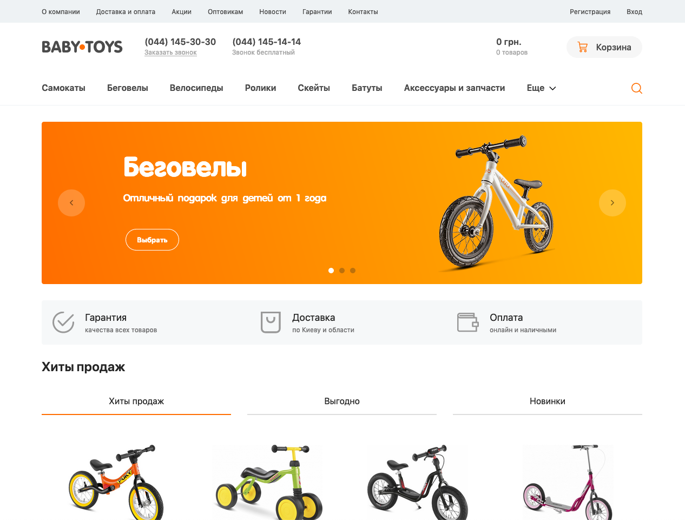

How to start
===
1) clone repository
				
		git clone https://github.com/pathliving/toys-store.git toys-store

2) go to 'toys-store' directory

		cd toys-store

3) install dependencies

		npm i

4) start project

		npm start

5) copy and open this link in your browser

		http://localhost:8080

	or click on this [link](http://localhost:8080)

View pages
---
1) [Home](https://pathliving.github.io/toys-store/index.html)
2) [Category](https://pathliving.github.io/toys-store/category.html)
3) [Product](https://pathliving.github.io/toys-store/product.html)
4) [Search](https://pathliving.github.io/toys-store/search.html)
5) [Brand](https://pathliving.github.io/toys-store/brand.html)
6) [Brands](https://pathliving.github.io/toys-store/brands.html)
7) [About](https://pathliving.github.io/toys-store/static-page.html)

Example
---

Built with
---

* [PUG](https://pugjs.org/api/getting-started.html)
* [SASS](https://sass-lang.com/)
* [jQuery](http://api.jquery.com/) ([slick](https://github.com/kenwheeler/slick), [svg4everybody](https://github.com/jonathantneal/svg4everybody), [magnific-popup](https://github.com/dimsemenov/Magnific-Popup))
* [Gulp](https://gulpjs.com/)
* [Git](https://git-scm.com/)

Support
---
1) Cross-browser compatibility 

		Chrome, Firefox, Safari, Edge, Opera
		IE - disable content (styles are rendering incorrectly)

2) Cross-platform

		Chrome, Firefox, Edge, Opera - on Windows
		Chrome, Firefox, Safari, Opera - on OSX

3) Responsive, adaptive and mobile compatibility client-side

		Desktop, laptop, tablet, fablet, mobile

Links
---

This project was using [GitHub Pages](https://pages.github.com/)

And this [Gulp starter](https://github.com/nicothin/NTH-start-project)